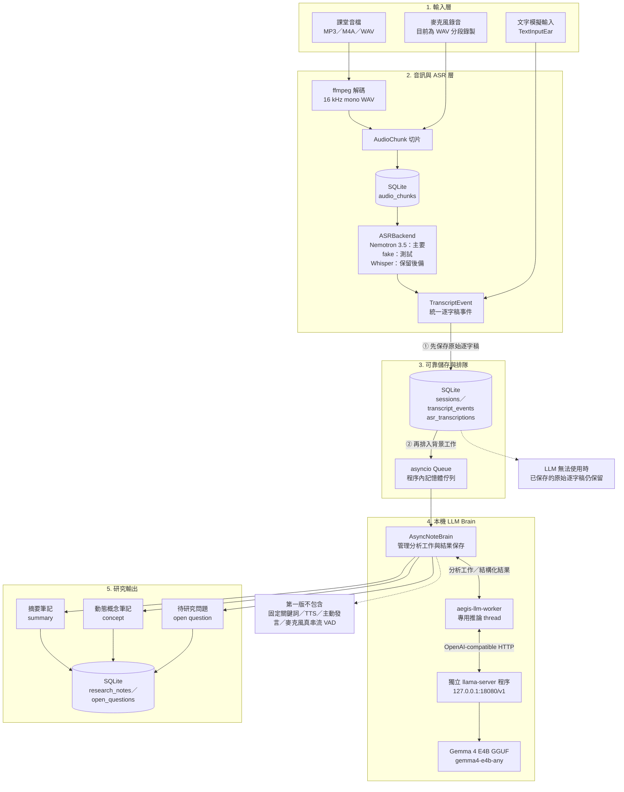

# Aegis Meeting Agent System

本專案是本機優先的 Aegis Meeting Agent。第一階段產品定位是「課堂旁聽研究助理」：持續接收課堂 transcript，立即保存原文，並由背景 Brain 非同步整理研究筆記與開放問題。

目前不實作 TTS、不做語音輸出，也不讓代理主動說話。

## 架構

系統採用模組化的 producer-consumer pipeline：

- `Ear`: 接收語音或文字輸入，產生轉錄事件。
- `Audio source`: 匯入或錄製 WAV chunks，保存原始音訊 metadata，供後續 ASR backend 使用。
- `ASR backend`: 從 `audio_chunks` 讀取 WAV chunk，產生 `TranscriptEvent`。`fake` 提供 deterministic 測試路徑；`nemotron-3.5-asr` 會載入本機 `.nemo` checkpoint 並以 CUDA 執行真實轉錄；`whisper` 是保留名稱。
- `SQLite store`: 建立 classroom listening session，保存 transcript、研究筆記與開放問題。
- `Brain worker`: 從 asyncio queue 取得 transcript，交給獨立推論 thread，
  再透過現有的 `llama-server` 呼叫本機 Gemma 4 E4B，動態產生研究筆記。

### 第一版架構圖



目前保留 `TextInputEar`，可用 stdin 模擬課堂 transcript。音訊主線使用 backend abstraction，Nemotron 3.5 ASR 已接通離線 WAV chunk 轉錄，真正的 microphone streaming 尚未實作。

Brain 不使用固定關鍵詞清單。逐字稿會先寫入 SQLite，再由背景 worker
呼叫 `http://127.0.0.1:18080/v1` 的 `gemma4-e4b-any` 模型，以結構化 JSON
產生動態概念筆記、摘要與待研究問題。LLM 推論失敗不會丟失已保存的逐字稿。

SQLite 資料庫預設位置：

```text
data/aegis.db
```

## 快速開始

先啟動這台機器既有的本機 Gemma router：

```bash
systemctl --user start hermes-drive-gemma.service
```

如需改用不同端點或模型，可設定：

```bash
set -x AEGIS_LLM_BASE_URL http://127.0.0.1:18080/v1
set -x AEGIS_LLM_MODEL gemma4-e4b-any
set -x AEGIS_LLM_TIMEOUT_SECONDS 120
```

Classroom listening mode：

```bash
./venv/bin/python aegis.py --classroom
```

輸入課堂 transcript；輸入 `/quit` 結束。結束時 pipeline 會 flush Brain queue，避免遺失尚未處理的 transcript。

查看 Brain 產生的研究筆記：

```bash
./venv/bin/python aegis.py --show-notes
```

查看開放問題：

```bash
./venv/bin/python aegis.py --show-questions
```

匯入並切分 WAV 音檔：

```bash
./venv/bin/python aegis.py --chunk-audio path/to/lecture.wav --chunk-seconds 5
```

MP3/M4A 等壓縮音檔會透過系統 `ffmpeg` 轉成 16kHz mono WAV chunks：

```bash
./venv/bin/python aegis.py --simulate-realtime-audio path/to/lecture.mp3 --max-chunks 2 --speed 0
```

用 fake ASR backend 轉錄既有 chunks，並把 transcript 丟給背景 Brain flush：

```bash
./venv/bin/python aegis.py --transcribe-chunks SESSION_ID --asr-backend fake --limit 2 --lang zh-CN
```

檢查 Nemotron ASR 本機環境但不安裝依賴、不下載模型。此專案預設本機模型路徑是 `nemotron/nemotron-3.5-asr-streaming-0.6b.nemo`：

```bash
./venv/bin/python aegis.py --probe-asr-env nemotron-3.5-asr --model-path nemotron/nemotron-3.5-asr-streaming-0.6b.nemo
```

依 NVIDIA 模型卡安裝已驗證的 NeMo ASR 依賴與測試工具：

```bash
uv pip install --python ./venv/bin/python -e '.[dev,nemotron]'
```

執行 Nemotron 真實轉錄。`--lang` 使用模型支援的 locale，例如簡體中文 `zh-CN`、台灣中文 `zh-TW`、英文 `en-US`；省略時使用 `auto`：

```bash
./venv/bin/python aegis.py --transcribe-chunks SESSION_ID --asr-backend nemotron-3.5-asr --model-path nemotron/nemotron-3.5-asr-streaming-0.6b.nemo --limit 1 --lang en-US --speaker lecturer
```

同一個 `audio_chunk_id + backend + language` 重跑時會自動跳過；不同 backend 或 language 仍可各自保留結果。Transcript 會保存 chunk 起訖秒數、speaker、audio chunk id，Nemotron metadata 另含 word/segment timestamps。

中文課堂 benchmark 使用 JSONL manifest。複製 [benchmarks/zh-classroom.example.jsonl](benchmarks/zh-classroom.example.jsonl) 的格式，讓 `audio_filepath` 指向 16 kHz mono WAV，並填入人工校對的 `reference`：

```bash
./venv/bin/python aegis.py --benchmark-asr benchmarks/zh-classroom.jsonl --asr-backend nemotron-3.5-asr --model-path nemotron/nemotron-3.5-asr-streaming-0.6b.nemo --lang zh-CN
```

報告預設寫入 `.artifacts/benchmarks/`，包含每筆與整體 CER、推論秒數及 real-time factor。CER 會先做 NFKC、大小寫、空白與標點正規化；沒有真實中文音訊與人工參考稿時，不應把 smoke test 當成模型品質數字。

麥克風裝置與錄音切片需要 optional audio dependency：

```bash
./venv/bin/python aegis.py --list-audio-devices
./venv/bin/python aegis.py --record-chunks 30 --chunk-seconds 5
```

非互動 legacy smoke test：

```bash
./venv/bin/python aegis.py --demo
```

範例輸入：

```text
> 我們今天要討論 Entropy 和 BCI 的關係
> 為什麼 BCI 和 AI 有關係
> ...
> /quit
```

Brain 會讓 Gemma 根據語意動態辨識重要概念與未解問題；累積 5 段
transcript 時，再要求模型產生一份 rolling summary。整個過程不依賴固定詞表。

## 下一步

1. 收集並人工校對中文課堂 benchmark 音訊，建立第一版真實 CER baseline。
2. 接 speaker diarization，自動產生 speaker label；目前 `--speaker` 是人工指定。
3. 記錄 GPU VRAM 峰值並比較 timestamp 開關的速度與記憶體成本。
4. 保留 `whisper` adapter 作為 fallback/baseline。
5. 將 microphone audio stream、VAD 與 Nemotron cache-aware streaming 串成 classroom pipeline。
6. 評估是否加入 RAG，但維持現有的非阻塞本機 LLM worker 邊界。

更多設計細節見 [docs/architecture.md](docs/architecture.md)。
