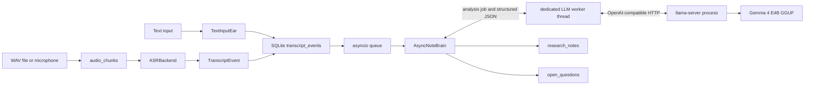

# Aegis Architecture

## Design Goal

Aegis is a local-first classroom listening research assistant. It should work as a durable listener first: capture transcript, preserve raw events, and asynchronously organize notes and questions for later review.

This stage is not a voice chatbot. It does not use TTS and it does not proactively speak.

The system is intentionally split into replaceable modules:

- `Ear`: capture and transcribe speech.
- `Audio source`: ingest existing WAV files or record microphone chunks.
- `ASR backend`: convert stored audio chunks into transcript events.
- `Store`: persist sessions, transcript events, research notes, and open questions.
- `Brain`: use the local Gemma 4 E4B model to dynamically interpret stored
  transcript events into notes and questions without a fixed keyword list.

## Pipeline



The initial implementation uses text input as the `Ear`. This keeps the event contracts stable while avoiding early coupling to PyAudio, CUDA, and Whisper runtime issues.

`TextInputEar` yields transcript events continuously. Each event is written to
SQLite before it is queued for Brain processing. `AsyncNoteBrain` submits the
blocking local-model request to one dedicated worker thread, while the actual
GGUF inference runs in the separate `llama-server` process. This keeps transcript
capture and SQLite persistence responsive while Gemma is generating. When the
Ear exits, the pipeline sends a sentinel and waits for the queue and worker to
drain before returning.

Stored `audio_chunks` use a separate ASR backend path. The backend interface is:

```python
ASRBackend.transcribe(chunk: AudioChunk, *, language: str | None = None) -> ASRResult
```

`ASRResult` contains transcript `text` and backend metadata. `fake` deterministically returns text from the chunk id and filename for tests. `nemotron-3.5-asr` lazily restores the local checkpoint on the CUDA device, transcribes WAV chunks through NeMo, and records model/runtime metadata. `whisper` remains a reserved fallback name.

## Event Contract

`ListeningSession` identifies each classroom run:

- `id`: session id.
- `created_at`: UTC creation time.
- `mode`: currently `classroom`.
- `title`: optional display title.

`TranscriptEvent` is the central input event:

- `id`: event id.
- `session_id`: owning classroom session.
- `text`: transcribed text.
- `speaker`: optional speaker label.
- `created_at`: event creation time.
- `source`: input source such as `stdin`, `mic`, or `asr:fake`.

`ResearchNote` is a generated note:

- `id`: note id.
- `session_id`: owning classroom session.
- `source_transcript_event_ids`: JSON-backed list of source event ids.
- `note_type`: `summary` or `concept`.
- `title`: short note title.
- `body`: note content.
- `created_at`: note creation time.

`OpenQuestion` is a generated follow-up question:

- `id`: question id.
- `session_id`: owning classroom session.
- `source_transcript_event_ids`: JSON-backed list of source event ids.
- `question`: detected question text.
- `status`: currently `open`.
- `created_at`: question creation time.

`AudioChunk` is raw audio prepared for transcription:

- `id`: chunk id.
- `session_id`: owning audio session.
- `path`: WAV chunk path.
- `original_source_path`: source WAV path for file ingests, empty for microphone.
- `duration_seconds`: chunk length.
- `sample_rate`: WAV sample rate.
- `channels`: channel count.
- `source`: `file` or `mic`.
- `created_at`: chunk creation time.
- `status`: currently `recorded` or `failed`.

`asr_transcriptions` stores ASR metadata without changing the stable transcript event table:

- `transcript_event_id`: generated transcript event.
- `audio_chunk_id`: source audio chunk.
- `backend`: backend name such as `fake`.
- `language`: optional language hint such as `zh-CN`.
- `metadata_json`: backend result metadata for reproducible debugging.

## SQLite Schema

The default database is `data/aegis.db`.

Tables:

- `sessions`
- `transcript_events`
- `research_notes`
- `open_questions`
- `audio_chunks`
- `asr_transcriptions`

## Current Brain Strategy

The first-version note brain calls the existing local Gemma 4 E4B model through
the OpenAI-compatible `llama-server` endpoint at
`http://127.0.0.1:18080/v1`:

- Model id: `gemma4-e4b-any`.
- Every transcript event is analyzed against a rolling local context.
- Important concepts are selected dynamically from meaning, not from a fixed
  keyword list.
- The model returns schema-constrained JSON containing `summary`, `concepts`,
  and `questions`.
- A rolling summary is requested every 5 transcript events.
- LLM HTTP or parsing failures do not discard the already stored transcript.

The endpoint and model can be overridden with `AEGIS_LLM_BASE_URL`,
`AEGIS_LLM_MODEL`, and `AEGIS_LLM_TIMEOUT_SECONDS`.

## Planned Modules

### Ear

Future production ear:

1. Capture microphone audio.
2. Keep a rolling buffer.
3. Use voice activity detection or silence detection to slice speech.
4. Send audio chunks to the configured ASR backend.
5. Emit cleaned transcript events.

### ASR

Current backend names:

- `fake`: executable deterministic backend for tests and pipeline plumbing.
- `nemotron-3.5-asr`: executable adapter for local `nvidia/nemotron-3.5-asr-streaming-0.6b`; it validates NeMo and CUDA, restores the `.nemo` checkpoint once per backend instance, and transcribes each stored WAV chunk.
- `whisper`: reserved fallback/baseline.

The offline path is:

```text
audio_chunks -> ASRBackend -> TranscriptEvent(source="asr:<backend>") -> Store -> AsyncNoteBrain
```

Default local Nemotron model path:

```text
nemotron/nemotron-3.5-asr-streaming-0.6b.nemo
```

Use `--probe-asr-env nemotron-3.5-asr --model-path nemotron/nemotron-3.5-asr-streaming-0.6b.nemo` to inspect Python, Torch, CUDA, NeMo ASR, ffmpeg, and local model presence without installing packages, downloading a model, or loading the 2.3GB `.nemo` file.

The prompt-conditioned model receives each chunk through a temporary NeMo manifest with an explicit `lang` field. The adapter defaults to `auto`, strips the trailing language tag from transcript text, and preserves the detected locale in ASR metadata.

ASR persistence is idempotent for `(audio_chunk_id, backend, language)`. A rerun skips existing rows, while another backend or locale can produce an independent result. `audio_chunks.start_seconds` provides the source-relative offset; transcript rows store `start_seconds`, `end_seconds`, `speaker`, and `audio_chunk_id`. Nemotron additionally records normalized word and segment timestamps from NeMo's `timestamps=True` hypothesis output.

The benchmark path reads a JSONL manifest of WAV files plus manually verified references and reports normalized Chinese CER and real-time factor. It runs outside session persistence so model-quality experiments do not pollute classroom transcript history.

Nemotron readiness statuses:

- `ready`: local model, ffmpeg, torch, CUDA, and `nemo.collections.asr` are available.
- `model present, missing nemo`: local `.nemo` exists but NeMo ASR runtime is not importable.
- `missing model`: configured `.nemo` path does not exist.
- `missing cuda`: torch imports, but CUDA is not available to the current process.
- `missing dependencies`: base runtime dependencies such as torch or ffmpeg are missing.

### Brain

Future production brain:

1. Load meeting/project materials from PDF, Markdown, and text.
2. Retrieve relevant context for each transcript event.
3. Maintain rolling meeting memory and action items.
4. Add optional RAG context without changing the local LLM worker boundary.
5. Evaluate prompt and schema quality against real classroom transcripts.

### Voice

Voice/TTS is intentionally out of scope for this classroom listening stage.

## CachyOS Notes

This project is expected to run on CachyOS KDE. Audio and GPU work should be verified against the real local system rather than assumed from generic Linux setup notes.
